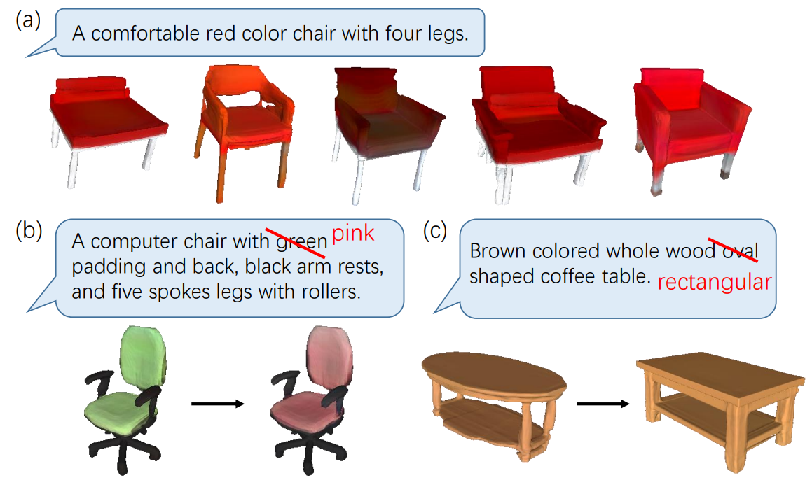

# Towards Implicit Text-Guided 3D Shape Generation
## Towards Implicit Text-Guided 3D Shape Generation (CVPR2022)

Code for the paper [Towards Implicit Text-Guided 3D Shape Generation], CVPR 2022.

This code is based on IM-Net https://github.com/czq142857/IM-NET-pytorch

**Authors**: Zhengzhe Liu, Yi Wang, Xiaojuan Qi, Chi-Wing Fu




## Installation

### Requirements
* Python 3.8.8
* Pytorch 1.10.0
* CUDA 11.3
* h5py
* scipy
* [mcubes](https://github.com/pmneila/PyMCubes)
* pytorch_lamb


## Data Preparation

* Download our [hdf5_train_new, hdf5_test_new](https://drive.google.com/file/d/1sc7HRpL3e8oYJXlN3CjLioTRln2GkXai/view?usp=sharing).

OR

* Download the [dataset](http://text2shape.stanford.edu/dataset/shapenet/nrrd_256_filter_div_128_solid.zip).

* unzip it to "generator" folder.

```
python 2_gather_256vox_16_32_64.py.py 
```


## Pretrained Model
We provide pretrained models for each training step. Still download it [here](https://drive.google.com/file/d/1sc7HRpL3e8oYJXlN3CjLioTRln2GkXai/view?usp=sharing). Put them to "generation/checkpoint/color_all_ae_64/"


## Inference

(1) Text-Guided Shape Generation

```
python main.py --res64 --sample_dir samples/im_ae_out --start 0 --end 7454 --high_resolution
```

You can generate coarse shapes fast by removing "--high_resolution"

(2) Diversified Generation

```
python main.py --div --sample_dir samples/im_ae_out --start 0 --end 7454 --high_resolution
```

Others:

(1) Auto-Encoder

```
python main.py --ae --sample_dir samples/im_ae_out --start 0 --end 7454
```

## Training Generation Model

```
sh train.sh
```


## Manipulation

## Trained Model
We provide trained models [here](https://drive.google.com/drive/folders/1LZ9q_W2H-ff_TcyvFG4EpGrl9xnprpgI?usp=sharing). Put them to "mainpulation/checkpoint/color_all_ae_64/"

## Inference

```
python main.py --color_chair --sample_dir samples/im_ae_out --start 0 --end 10 --high_resolution
python main.py --color_table --sample_dir samples/im_ae_out --start 0 --end 10 --high_resolution
python main.py --shape_chair --sample_dir samples/im_ae_out --start 0 --end 10 --high_resolution
python main.py --shape_table --sample_dir samples/im_ae_out --start 0 --end 10 --high_resolution
```

You can generate coarse shapes fast by removing "--high_resolution"


## Training Manipulation Model

Put the above "div.model64-199_raw.pth" in the generation-model set to "mainpulation/checkpoint/color_all_ae_64/" as the initialization model. 

```
python main.py --color_chair --train --epoch 150 --sample_vox_size 64
python main.py --shape_chair --train --epoch 150 --sample_vox_size 64
python main.py --color_table --train --epoch 150 --sample_vox_size 64
python main.py --shape_table --train --epoch 150 --sample_vox_size 64
```

## Contact
If you have any questions or suggestions about this repo, please feel free to contact me (liuzhengzhelzz@gmail.com).

